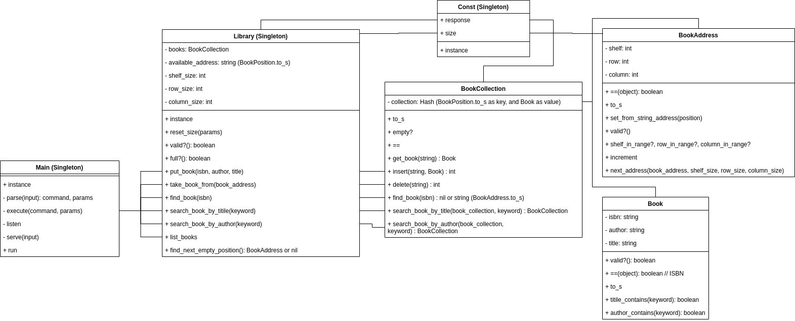

# Final Project in Advanced Level
## Requirements
This is the document of [requirements for the final project](https://classroom.google.com/w/MjY1NDM0Njg4MDQ2/tc/MjY1NTQ1MTM2NjUw). The requirements are:
1. Store books into the shelf's slot address
2. Find the slot address of a first book with a given ISBN
3. List of all books (ISBN, title, author) and their slot addresses
4. Search the books by title keyword
5. Search the books by author keyword

## Project structure
TBD

## Instructions
1. Install the needed gems.
```
bundle install
```
2. Run the testing code by using 
```
rspec -fd
```
3. Run the main by using 
```
ruby main.rb
```

## Class diagram


## Command examples
```
build_library|2|1|3 
// Shelf 1 with 1 rows and 3 columns is added 
// Shelf 2 with 1 rows and 3 columns is added 

put_book|9780747532743|Harry Potter 1|J. K. Rowling 
// Allocated address: 010101 

put_book|9780807281918|Harry Potter 2|J. K. Rowling 
// Allocated address: 010102 

put_book|9780739330944|Eragon 1|Christopher Paolini 
// Allocated address: 010103 

put_book|9780545582933|Harry Potter 3|J. K. Rowling 
// Allocated address: 020101 

put_book|9780132350884|Clean Code|Robert Cecil Martin 
// Allocated address: 020102 

put_book|9780201485677|Refactoring|Martin Fowler, Kent Beck
// Allocated address: 020103

take_book_from|020102 
// Slot 020102 is free 

take_book_from|010102 
// Slot 010102 is free 

put_book|9780132350884|Clean Code|Robert Cecil Martin 
// Allocated address: 010102 

put_book|9780807281918|Harry Potter 2|J. K. Rowling 
// Allocated address: 020102

put_book|9780321146533|TDD: By Example|Kent Beck 
// All shelves are full! 

take_book_from|999999 
// Invalid code! 

find_book|9780807281918 
// Found the book at 020102 

find_book|000 
// Book not found! 

list_books 
// 010101: 9780747532743 | Harry Potter 1 | J. K. Rowling 
// 010102: 9780132350884 | Clean Code | Robert Cecil Martin 
// 010103: 9780739330944 | Eragon 1 | Christopher Paolini 
// 020101: 9780545582933 | Harry Potter 3 | J. K. Rowling 
// 020102: 9780807281918 | Harry Potter 2 | J. K. Rowling \
// 020103: 9780201485677 | Refactoring | Martin Fowler, Kent Beck 

search_books_by_title|Harry Potter 
// 010101: 9780747532743 | Harry Potter 1 | J. K. Rowling 
// 020101: 9780545582933 | Harry Potter 3 | J. K. Rowling 
// 020102: 9780807281918 | Harry Potter 2 | J. K. Rowling

search_books_by_author|Kent Beck 
// 010102: 9780132350884 | Clean Code | Robert Cecil Martin 
// 020103: 9780201485677 | Refactoring | Martin Fowler, Kent Beck 

search_books_by_author|Tolkien 
Book not found! 

exit
```