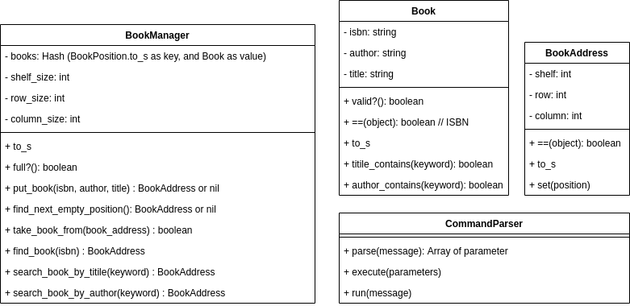

# Final Project in Advanced Level
## Requirements
This is the document of [requirements for the final project](https://classroom.google.com/w/MjY1NDM0Njg4MDQ2/tc/MjY1NTQ1MTM2NjUw). The requirements are:
1. Store books into the shelf's slot address
2. Find the slot address of a first book with a given ISBN
3. List of all books (ISBN, title, author) and their slot addresses
4. Search the books by title keyword
5. Search the books by author keyword

## Project structure
TBD

## Instructions
1. Install the needed gems.
```
gem install simplecov
```
2. TODO : define the next steps

## Class diagram
